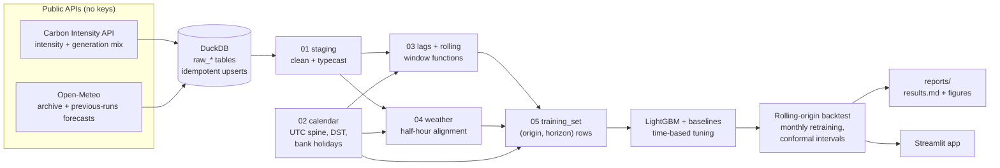

# GB Carbon Intensity Forecast

[](https://github.com/FU77META7/uk-carbon-intensity-forecast/actions/workflows/ci.yml)

How well can the carbon intensity of the GB electricity grid (gCO2/kWh) be forecast
24-48 hours ahead, at 30-minute resolution? This project ingests public grid and
weather data into DuckDB, builds leakage-free features in SQL, trains a direct
multi-horizon LightGBM model, and evaluates it against naive baselines in a
rolling-origin backtest with monthly retraining.

<!-- headline:start -->
Over a 12-month rolling-origin backtest (Oct 2025 to Sep 2026, 70,668 forecasts, monthly retraining), LightGBM with leakage-free weather forecasts has an MAE of **27.2 gCO2/kWh** across 24-48 hour horizons, 43% lower than a seasonal naive baseline (48.0), and beats that baseline in 12 of 12 months. Its conformally calibrated 10-90% intervals cover 78.5% of outcomes (target 80%).
<!-- headline:end -->

**Where to look first:** feature engineering in [`sql/`](sql/) (window functions, a
DST-aware settlement-period calendar, as-of availability rules), the leakage tests in
[`tests/test_features.py`](tests/test_features.py), and the full results in
[`reports/results.md`](reports/results.md).

## Why it matters

Grid carbon intensity in Great Britain swings widely within a day and between days,
mostly with wind and solar output. A reliable day-ahead forecast lets flexible demand,
such as EV charging, heat pumps with storage, and batch computing, shift into
low-carbon hours without touching the grid itself. The value of that shifting depends
on forecasting the *next* day well, which is why this project focuses on the 24-48
hour window and on honest out-of-sample evaluation rather than a same-day nowcast.

## Architecture



- **Ingestion** (`src/carbon_forecast/ingest/`): chunked requests sized to the limits
  verified against each live API, retries with exponential backoff, a polite rate limit,
  and a gaps-and-islands query that plans requests only for missing periods. Re-running
  is incremental and idempotent. All timestamps are stored in UTC.
- **Features** (`sql/01-05`): run in order by `carbon_forecast.features`. Every input
  carries an `asof_*` timestamp recording when it became available.
- **Model** (`src/carbon_forecast/models/`): one global LightGBM model with the horizon as
  a feature, rather than one model per horizon. The 49 horizons share almost all structure,
  so a single model sees 49 times more rows and gives smooth predictions across horizons.
- **Backtest** (`src/carbon_forecast/backtest.py`): expanding window, retrained at the start
  of every test month on all rows whose target precedes it.

## Data sources

| Source | What | Licence / terms |
|---|---|---|
| [Carbon Intensity API](https://carbon-intensity.github.io/api-definitions/) (NESO with partners) | National half-hourly actual and forecast intensity; generation mix (%) | [CC BY 4.0](https://carbonintensity.org.uk/) |
| [Open-Meteo Historical Weather API](https://open-meteo.com/en/docs/historical-weather-api) | Observed hourly weather (reanalysis) at six GB sites; used only for the leaky oracle | Data [CC BY 4.0](https://open-meteo.com/en/licence); free API is non-commercial with daily, hourly and per-minute call limits |
| [Open-Meteo Previous Runs API](https://open-meteo.com/en/docs/previous-runs-api) | Weather *forecasts* as issued 1-3 days before each hour (ECMWF IFS 0.25°), from March 2024 | As above |
| [Open-Meteo Historical Forecast API](https://open-meteo.com/en/docs/historical-forecast-api) | Ingested only to check whether it is a genuine forecast (it is not; see Limitations) | As above |
| [`holidays`](https://pypi.org/project/holidays/) package | England & Wales and Scotland bank holidays | MIT |

Weather data by [Open-Meteo.com](https://open-meteo.com/). Sites cover the largest wind
fleets (Hornsea, Moray Firth, Whitelee), the main solar clusters (Somerset, East Anglia)
and the London demand centre; the reasoning is in
[`config/settings.yaml`](config/settings.yaml). A data quality report (row counts,
gaps, duplicates, nulls, clock-change days, suspect values) is in
[`reports/data_quality.md`](reports/data_quality.md).

## Results

<!-- results:start -->
All models are scored on the same 70,668 forecasts (origins every 6 hours, 49 horizons from 24h to 48h). Errors in gCO2/kWh; skill = 1 - MAE / MAE of the seasonal naive baseline.

| Model | MAE | RMSE | MAPE % | Skill |
|---|---|---|---|---|
| LightGBM + weather forecast | 27.17 | 35.21 | 27.02 | 0.43 |
| LightGBM, no weather | 41.48 | 49.94 | 45.98 | 0.14 |
| Seasonal naive (latest day) | 48.04 | 61.60 | 47.95 | 0.00 |
| Seasonal naive (week) | 54.47 | 68.96 | 53.75 | -0.13 |
| Persistence | 53.85 | 67.67 | 54.18 | -0.12 |
| LightGBM, no weather, short history | 42.18 | 51.47 | 46.07 | 0.12 |
| LightGBM + observed weather (leaky oracle) | 26.03 | 32.95 | 26.73 | 0.46 |
| NESO stored forecast (short-lead nowcast) | 9.83 | 14.13 | 9.40 |  |

*Observed weather* is a leaky upper bound (it uses the weather that actually happened). The *NESO stored forecast* is a short-lead nowcast, not a 24-48h forecast; see [Limitations](#limitations--honest-caveats).

MAE by horizon:

| Hours ahead | LightGBM + weather forecast | LightGBM, no weather | Seasonal naive (latest day) | LightGBM + observed weather (leaky oracle) |
|---|---|---|---|---|
| 24.0 | 26.5 | 38.9 | 47.5 | 25.1 |
| 30.0 | 26.6 | 40.4 | 47.5 | 25.8 |
| 36.0 | 26.8 | 41.1 | 47.4 | 26.4 |
| 42.0 | 28.3 | 41.1 | 47.4 | 26.3 |
| 48.0 | 28.7 | 41.2 | 52.0 | 26.4 |

Prediction intervals (10-90%): raw quantile LightGBM covers 69.8% of actuals; after conformal calibration, 78.5% (mean width 82 -> 95 gCO2/kWh).
<!-- results:end -->


Weather forecasts help most when wind output is high, which is where the model without
weather does worst:


A typical week, chosen by rule (the week whose error is closest to the median week):


Breakdowns by month, season and time of day, the calibration of the prediction
intervals fold by fold, and SHAP feature attributions are in
[`reports/results.md`](reports/results.md). Hyperparameter tuning is documented in
[`reports/tuning.md`](reports/tuning.md).

## Limitations & honest caveats

**The NESO comparison is not like-for-like.** The API stores a single `forecast` value per
half-hour and does not document its lead time. Scoring it against persistence on the same
half-hours shows it is a short-lead nowcast:

<!-- neso:start -->
| predictor | mae | n |
|---|---|---|
| NESO stored forecast | 9.8 | 17,369 |
| Persistence (30 min lag) | 4.9 | 17,369 |
| Persistence (1 h lag) | 9.0 | 17,369 |
| Persistence (2 h lag) | 16.4 | 17,369 |
| Persistence (6 h lag) | 37.2 | 17,369 |
| Persistence (24 h lag) | 39.8 | 17,369 |
| Persistence (48 h lag) | 47.8 | 17,369 |

The stored NESO forecast (MAE 9.8) is worse than persistence (1 h lag) but better than persistence (2 h lag). A forecast issued 24-48 hours ahead could not match persistence at such short lags: the lowest MAE of any 24-48h model at any horizon in this backtest is 25.1. The stored value is therefore a short-lead nowcast, and comparing it with the 24-48h models is not like-for-like.
<!-- neso:end -->

It is reported for reference only; this project does not claim to beat NESO.

**Weather leakage.** Actual weather is not a forecast input. Open-Meteo's *historical
forecast* API looks like a fix but is not: it stitches together the first hours of each
model run, and at our sites it returns archive values outright in earlier years (see the
year-by-year comparison in the data quality report). The deployable model instead uses
the Previous Runs API, which gives what the forecast said 1-3 days before each hour. A
forecast is treated as usable only 8 hours after it was made, so the lead-day switches
from 2 to 3 days at about 40 hours ahead; the visible step in error there is the price of
that rule. Those forecasts only exist from March 2024, so the weather model trains on a
shorter history than the no-weather model (an ablation separates the two effects). The
"observed weather" model is kept as a clearly labelled, non-deployable upper bound.

**Other leakage controls.** Actual intensity and generation mix are treated as published
60 minutes after each half-hour ends, a conservative margin over what the live API showed.
For the same reason the "seasonal naive" baseline has to use the same time *two* days
earlier (three beyond 46.5 hours ahead): yesterday's value is not known yet when a
day-ahead forecast is issued. A leak test corrupts everything published after a forecast
origin, rebuilds the features and asserts none of them change. It caught a real leak
during development: half-hourly weather is interpolated from the next hourly value, so
the lead day must be chosen from that later hour.

**National scope.** The target is the GB national average. Regional intensity, which the
same API publishes for 14 regions, is not modelled; it would need regional weather and
the network constraints between regions.

**Data caveats.**
- Historical actuals are the values the API holds today, not the first estimates a live
  system would have seen; values for recent half-hours changed between two downloads made
  during this project. That flatters features built on recent history slightly, and
  cannot be corrected without archived vintages.
- A few upstream gaps and impossible values (zero, or forecasts above 1,000 gCO2/kWh)
  exist; staging sets impossible values to null and the data quality report lists them.
- The generation mix is published as percentages only, not MW.
- Two undocumented API behaviours shaped the ingestion code: `/intensity` accepts 31-day
  ranges although the docs say 14, and `/generation` silently truncates any request that
  spans 1 January. Both were verified against the live API.

**Model limitations.** The no-weather model over-forecasts on average, because intensity
has fallen since the early training years and trees do not extrapolate a trend. Weather
enters as coarse averages over six sites; the small gap between forecast and observed
weather suggests richer weather inputs, not better weather forecasts, are the next gain.

**Interval calibration.** Conformal calibration fixes the overall coverage, but it
assumes the calibration month resembles the test month. Time series violate that, so
coverage still varies month to month (see the per-fold table in the results).

**What would change in production.**
- Scheduled ingestion and forecasting, with live weather from Open-Meteo's forecast API
  under the same lead-time rules, and alerting when inputs arrive late.
- Storing every forecast as issued (vintages), both for NESO and for this model, so
  comparisons are genuinely like-for-like.
- Monitoring of error and interval coverage against rolling baselines, with adaptive
  calibration and a retraining trigger rather than a fixed monthly schedule.
- A commercial Open-Meteo licence: the free API is non-commercial only.

## Reproduce

Requirements: [uv](https://docs.astral.sh/uv/), and on macOS the OpenMP runtime for
LightGBM (`brew install libomp`).

```bash
uv sync && make all
```

`make all` pulls every source from 2019-01-01 to yesterday into `data/carbon.duckdb`
(gitignored), builds the SQL features, tunes, backtests, and regenerates `reports/` and
the generated sections of this README. A full rebuild from an empty database took about
20 minutes, mostly deliberate pacing of API requests. Re-running ingestion only fetches
what is missing.

Results are deterministic: two rebuilds from the same data produce identical reports.
LightGBM runs with a fixed seed in deterministic mode, and SQL averages use a fixed
summation order, since
a parallel `avg()` adds values in thread order and its last bits can otherwise differ
between runs. A rebuild on a later date will differ slightly, because it ingests more
recent data and any upstream revisions.

Other targets: `make test` (runs offline on small fixtures; CI runs ruff and pytest on
every push), `make app` (the Streamlit results explorer; close it before rebuilding,
since DuckDB blocks writers while it is open), and `make all DB=/tmp/fresh.duckdb` to
rebuild into a separate database.

```
sql/                  feature layers 00-05, run in order
src/carbon_forecast/  ingest/, features.py, models/, backtest.py, evaluate.py, app_data.py
app/                  Streamlit app (reads backtest tables; never trains)
notebooks/            exploratory analysis only
reports/              generated: data quality, tuning, results, figures
tests/                offline tests on fixtures; no network access
```

## Future work

- **Regional forecasts** for the 14 regions the API publishes, with regional weather.
- **Probabilistic forecasting**: adaptive conformal inference, which updates the interval
  width as each actual arrives, for coverage that holds month by month.
- **Scheduled retraining and live forecasting**, including logging NESO's forecast as
  issued so its true 24-48h accuracy can be measured.
- **Richer weather inputs**: gridded wind and solar forecasts weighted by installed
  capacity instead of six point sites.
