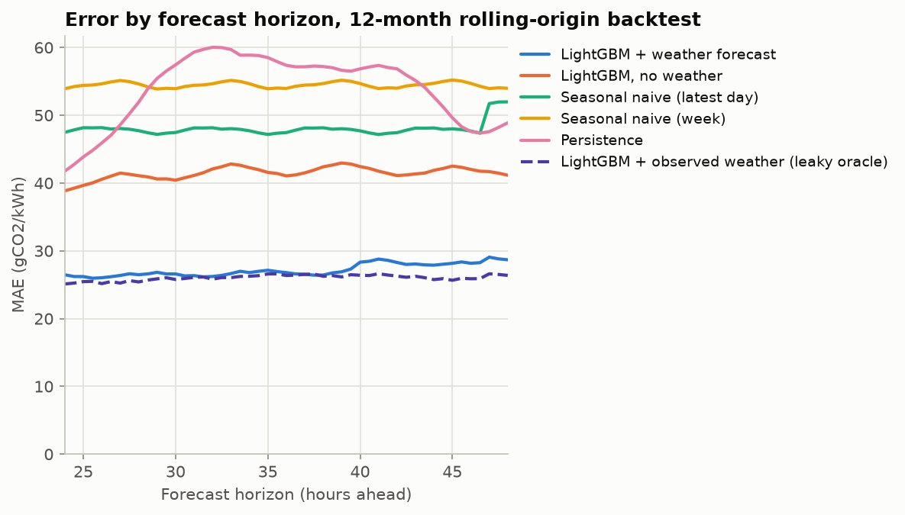
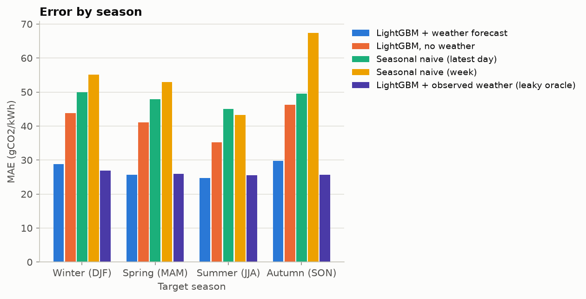
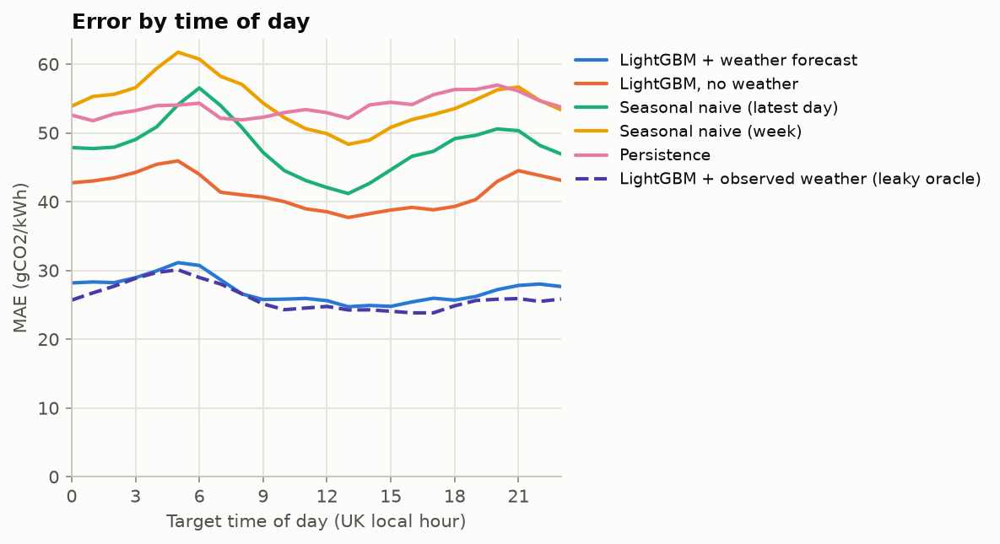
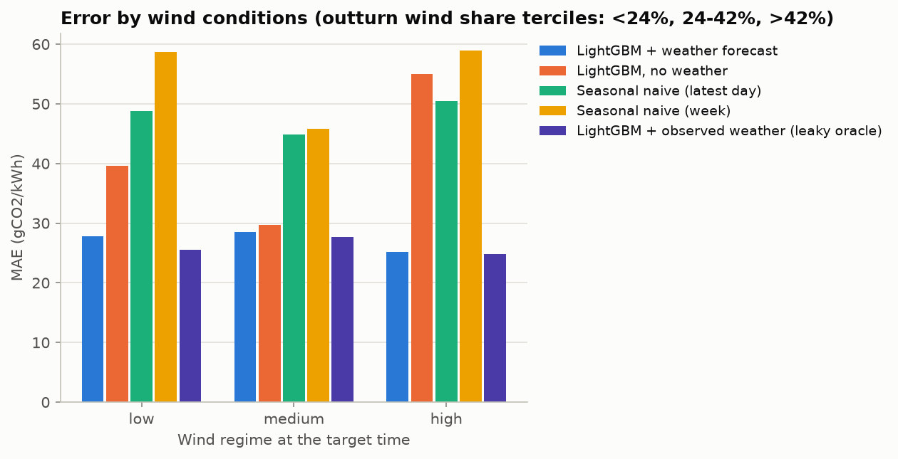
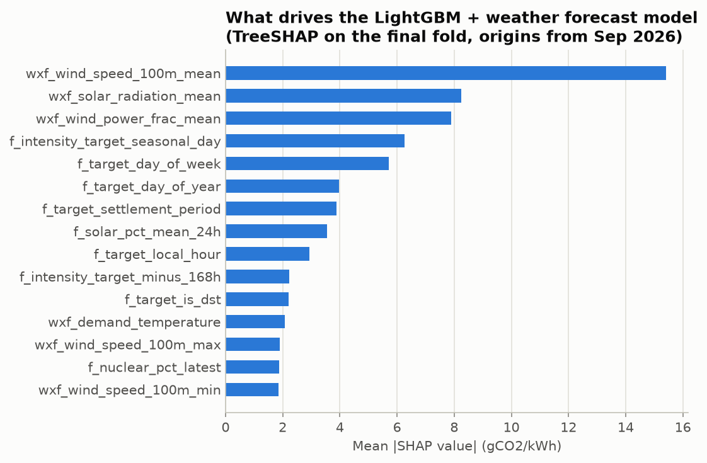
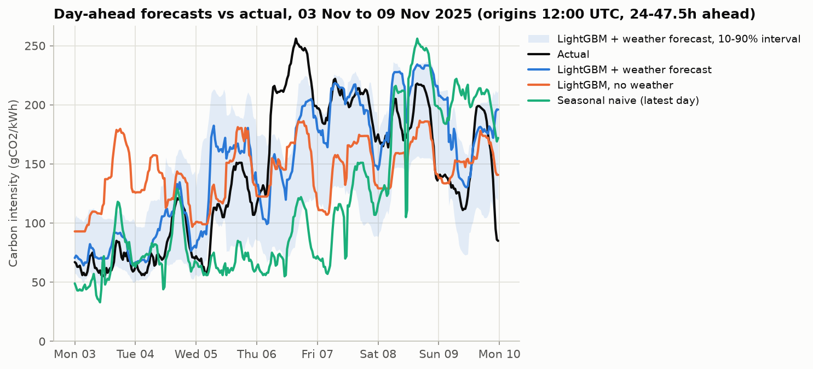
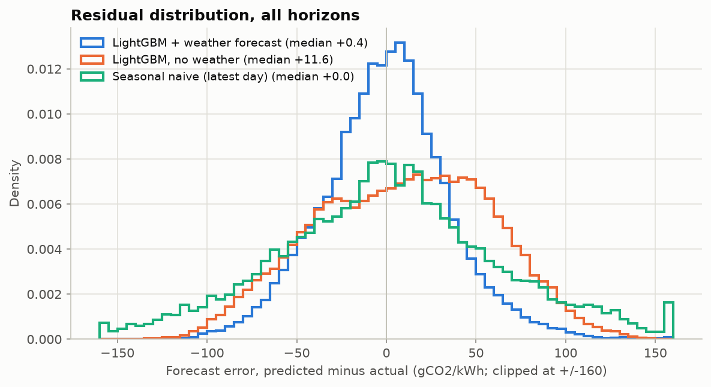
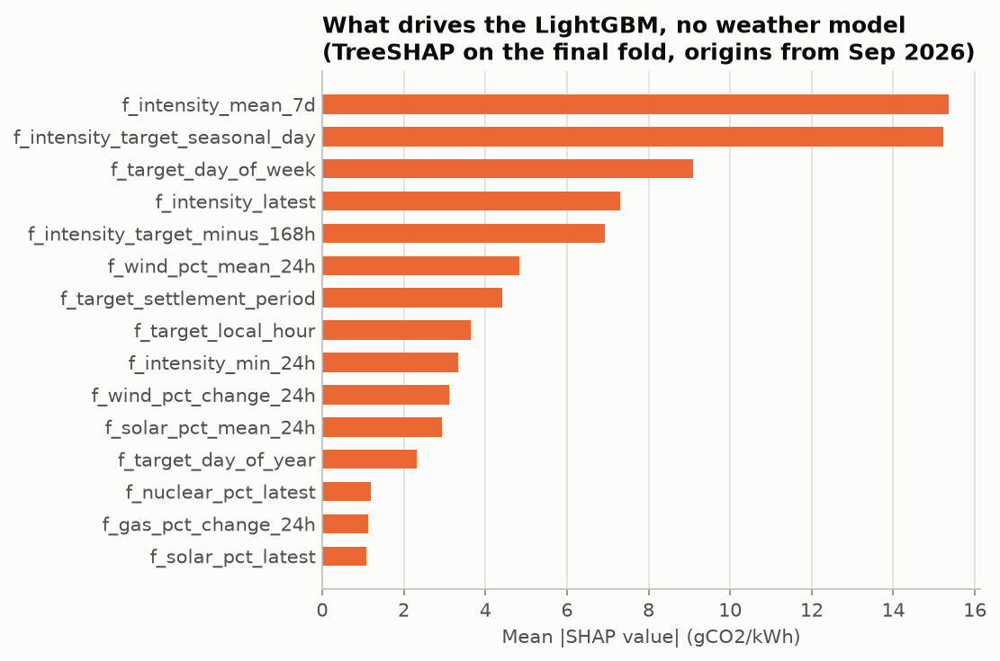

# Backtest results

Generated 2026-09-28 18:24 UTC by `python -m carbon_forecast.evaluate` from the `backtest_results` table written by `python -m carbon_forecast.backtest`. Every number below comes from that run.

## Set-up

- Rolling-origin backtest over origins 2025-10-01 to 2026-09-26 18:00 UTC: 12 monthly folds, expanding training window, every model retrained at the start of each month on all rows whose target precedes that month.
- Forecast origins every 6 hours (00/06/12/18 UTC); 49 horizons from 24h to 48h ahead at 30-minute resolution.
- All models are scored on the same 70,668 (origin, horizon) rows: those where every model, the NESO reference and the interval forecasts exist.
- Hyperparameters were tuned once on the six months before the test period (`reports/tuning.md`) and not revisited.
- Skill = 1 - MAE / MAE of the seasonal naive (latest published day) baseline.

**Reading the table:** `LightGBM + observed weather` uses outturn weather at the target time and is a leaky upper bound, not a deployable model. The NESO stored forecast is a short-lead nowcast (its error matches ~1h persistence), so it is not a like-for-like comparison with 24-48h forecasts and is shown for reference only.

## Overall

| model | n | mae | rmse | mape | skill_vs_seasonal_naive_day |
|---|---|---|---|---|---|
| LightGBM + weather forecast | 70,668 | 27.173 | 35.212 | 27.020 | 0.434 |
| LightGBM, no weather | 70,668 | 41.482 | 49.937 | 45.985 | 0.136 |
| Seasonal naive (latest day) | 70,668 | 48.039 | 61.602 | 47.953 | 0.000 |
| Seasonal naive (week) | 70,668 | 54.473 | 68.958 | 53.748 | -0.134 |
| Persistence | 70,668 | 53.849 | 67.666 | 54.179 | -0.121 |
| LightGBM, no weather, short history | 70,668 | 42.176 | 51.470 | 46.073 | 0.122 |
| LightGBM + observed weather (leaky oracle) | 70,668 | 26.034 | 32.951 | 26.730 | 0.458 |
| NESO stored forecast (short-lead nowcast) | 70,668 | 9.831 | 14.126 | 9.400 | 0.795 |

The deployable weather-forecast model has MAE 27.2 gCO2/kWh (skill 0.43); without weather, MAE 41.5 (skill 0.14). Month by month, the weather-forecast model beats the seasonal naive baseline in 12 of 12 folds and the no-weather model in 11 of 12.

## Is the NESO comparison like-for-like?

The Carbon Intensity API keeps one stored forecast per half-hour, and its lead time is not documented. Its error next to persistence at increasing lags, on the same half-hours of the test period:

| predictor | mae | n |
|---|---|---|
| NESO stored forecast | 9.84 | 17,369 |
| Persistence (30 min lag) | 4.93 | 17,369 |
| Persistence (1 h lag) | 8.97 | 17,369 |
| Persistence (2 h lag) | 16.40 | 17,369 |
| Persistence (6 h lag) | 37.21 | 17,369 |
| Persistence (24 h lag) | 39.85 | 17,369 |
| Persistence (48 h lag) | 47.84 | 17,369 |

The stored NESO forecast (MAE 9.8) is worse than persistence (1 h lag) but better than persistence (2 h lag). A forecast issued 24-48 hours ahead could not match persistence at such short lags: the lowest MAE of any 24-48h model at any horizon in this backtest is 25.1. The stored value is therefore a short-lead nowcast, and comparing it with the 24-48h models is not like-for-like.

## By horizon

MAE (gCO2/kWh) at selected horizons; all 49 horizons are in `reports/metrics_by_horizon.csv` and the `backtest_metrics_by_horizon` table.

| horizon_h | LightGBM + weather forecast | LightGBM, no weather | Seasonal naive (latest day) | Seasonal naive (week) | Persistence | LightGBM, no weather, short history | LightGBM + observed weather (leaky oracle) | NESO stored forecast (short-lead nowcast) |
|---|---|---|---|---|---|---|---|---|
| 24.00 | 26.47 | 38.85 | 47.49 | 53.91 | 41.76 | 40.17 | 25.11 | 9.54 |
| 30.00 | 26.59 | 40.42 | 47.46 | 53.92 | 57.44 | 41.25 | 25.77 | 9.55 |
| 36.00 | 26.79 | 41.06 | 47.45 | 53.96 | 57.38 | 41.68 | 26.36 | 9.55 |
| 42.00 | 28.28 | 41.10 | 47.43 | 54.00 | 56.85 | 42.10 | 26.27 | 9.56 |
| 48.00 | 28.68 | 41.16 | 51.98 | 53.99 | 48.89 | 42.65 | 26.37 | 9.56 |

Skill vs seasonal naive (latest published day):

| horizon_h | LightGBM + weather forecast | LightGBM, no weather | Seasonal naive (latest day) | Seasonal naive (week) | Persistence | LightGBM, no weather, short history | LightGBM + observed weather (leaky oracle) |
|---|---|---|---|---|---|---|---|
| 24.000 | 0.443 | 0.182 | 0.000 | -0.135 | 0.121 | 0.154 | 0.471 |
| 30.000 | 0.440 | 0.148 | 0.000 | -0.136 | -0.210 | 0.131 | 0.457 |
| 36.000 | 0.435 | 0.135 | 0.000 | -0.137 | -0.209 | 0.122 | 0.444 |
| 42.000 | 0.404 | 0.133 | 0.000 | -0.138 | -0.199 | 0.112 | 0.446 |
| 48.000 | 0.448 | 0.208 | 0.000 | -0.039 | 0.059 | 0.180 | 0.493 |

RMSE (gCO2/kWh):

| horizon_h | LightGBM + weather forecast | LightGBM, no weather | Seasonal naive (latest day) | Seasonal naive (week) | Persistence | LightGBM, no weather, short history | LightGBM + observed weather (leaky oracle) | NESO stored forecast (short-lead nowcast) |
|---|---|---|---|---|---|---|---|---|
| 24.00 | 34.42 | 47.03 | 61.08 | 68.22 | 54.54 | 49.08 | 32.14 | 13.75 |
| 30.00 | 34.51 | 48.59 | 61.06 | 68.24 | 71.72 | 50.27 | 32.85 | 13.75 |
| 36.00 | 34.90 | 49.58 | 61.06 | 68.26 | 70.92 | 51.03 | 33.47 | 13.76 |
| 42.00 | 36.60 | 49.70 | 61.05 | 68.28 | 70.40 | 51.53 | 33.35 | 13.76 |
| 48.00 | 37.23 | 49.70 | 65.87 | 68.28 | 62.52 | 51.82 | 33.48 | 13.77 |

MAPE (%):

| horizon_h | LightGBM + weather forecast | LightGBM, no weather | Seasonal naive (latest day) | Seasonal naive (week) | Persistence | LightGBM, no weather, short history | LightGBM + observed weather (leaky oracle) | NESO stored forecast (short-lead nowcast) |
|---|---|---|---|---|---|---|---|---|
| 24.0 | 25.3 | 41.3 | 46.0 | 51.7 | 39.1 | 42.2 | 25.0 | 8.9 |
| 30.0 | 25.6 | 43.4 | 46.0 | 51.7 | 56.2 | 43.7 | 26.0 | 8.9 |
| 36.0 | 25.8 | 44.1 | 46.0 | 51.8 | 55.9 | 44.3 | 26.5 | 8.9 |
| 42.0 | 27.3 | 44.1 | 46.0 | 51.8 | 56.3 | 44.4 | 26.3 | 8.9 |
| 48.0 | 27.5 | 43.9 | 50.5 | 51.8 | 46.7 | 44.9 | 26.3 | 8.9 |

## By month (fold)

| fold_start_utc | LightGBM + weather forecast | LightGBM, no weather | Seasonal naive (latest day) | Seasonal naive (week) | Persistence | LightGBM, no weather, short history | LightGBM + observed weather (leaky oracle) |
|---|---|---|---|---|---|---|---|
| 2025-10 | 34.19 | 53.30 | 50.56 | 83.39 | 49.55 | 61.59 | 29.44 |
| 2025-11 | 30.62 | 46.49 | 52.79 | 63.09 | 58.60 | 43.30 | 23.97 |
| 2025-12 | 33.18 | 43.84 | 51.18 | 46.95 | 55.26 | 48.55 | 28.34 |
| 2026-01 | 26.76 | 48.47 | 54.46 | 64.90 | 61.21 | 48.80 | 27.21 |
| 2026-02 | 26.80 | 39.83 | 46.29 | 51.61 | 55.91 | 38.96 | 25.79 |
| 2026-03 | 24.46 | 48.59 | 58.20 | 73.85 | 57.47 | 50.05 | 26.10 |
| 2026-04 | 26.99 | 36.78 | 46.10 | 37.33 | 48.45 | 37.98 | 24.62 |
| 2026-05 | 25.56 | 35.64 | 36.41 | 47.72 | 46.45 | 34.70 | 26.88 |
| 2026-06 | 27.85 | 36.60 | 47.16 | 42.04 | 54.76 | 36.84 | 23.25 |
| 2026-07 | 22.61 | 33.73 | 48.47 | 42.70 | 54.04 | 31.70 | 25.33 |
| 2026-08 | 23.10 | 35.72 | 40.29 | 45.36 | 52.81 | 34.83 | 27.48 |
| 2026-09 | 23.40 | 37.85 | 43.67 | 53.61 | 51.47 | 37.38 | 23.30 |

## Error breakdowns (MAE, gCO2/kWh)

### By season

| season | LightGBM + weather forecast | LightGBM, no weather | Seasonal naive (latest day) | Seasonal naive (week) | Persistence | LightGBM, no weather, short history | LightGBM + observed weather (leaky oracle) |
|---|---|---|---|---|---|---|---|
| Winter (DJF) | 28.77 | 43.77 | 49.92 | 55.07 | 56.72 | 44.99 | 26.93 |
| Spring (MAM) | 25.68 | 41.04 | 47.85 | 52.90 | 51.68 | 41.73 | 25.99 |
| Summer (JJA) | 24.67 | 35.17 | 45.03 | 43.32 | 53.77 | 34.22 | 25.48 |
| Autumn (SON) | 29.75 | 46.27 | 49.47 | 67.36 | 53.26 | 48.17 | 25.72 |

### By time of day (UK local hour of the target)

| time_of_day | LightGBM + weather forecast | LightGBM, no weather | Seasonal naive (latest day) | Seasonal naive (week) | Persistence | LightGBM, no weather, short history | LightGBM + observed weather (leaky oracle) |
|---|---|---|---|---|---|---|---|
| 00-06 | 29.10 | 44.11 | 49.55 | 57.02 | 53.04 | 45.17 | 28.09 |
| 06-12 | 27.29 | 41.02 | 49.45 | 55.60 | 52.83 | 41.62 | 26.30 |
| 12-18 | 25.22 | 38.53 | 44.02 | 50.40 | 53.84 | 38.59 | 24.17 |
| 18-24 | 27.07 | 42.28 | 49.14 | 54.87 | 55.69 | 43.32 | 25.58 |

### By wind conditions

Terciles of outturn wind share at the target time: low < 23.7%, medium 23.7-42.1%, high > 42.1%. Outturn is used only to slice errors after the fact, never as a model input.

| wind_regime | LightGBM + weather forecast | LightGBM, no weather | Seasonal naive (latest day) | Seasonal naive (week) | Persistence | LightGBM, no weather, short history | LightGBM + observed weather (leaky oracle) |
|---|---|---|---|---|---|---|---|
| low | 27.85 | 39.65 | 48.76 | 58.67 | 58.01 | 42.02 | 25.51 |
| medium | 28.49 | 29.72 | 44.88 | 45.80 | 51.80 | 29.11 | 27.74 |
| high | 25.19 | 55.01 | 50.46 | 58.91 | 51.73 | 55.33 | 24.86 |

## Prediction intervals (weather-forecast model)

A well-calibrated 10-90% interval covers 80% of actuals. **Raw quantile**: LightGBM at the 10th and 90th percentiles, same features and settings as the point model, trained on targets up to one month before each fold. **Conformal (CQR)**: the raw band widened on both sides by the conformity-score quantile measured on that held-out month (Romano et al., 2019), which lies strictly before the fold, so no test data is used. CQR's coverage guarantee assumes exchangeable data; time series are not, so coverage here is measured, not guaranteed.

| interval | horizons | n | coverage_% | below_p10_% | above_p90_% | mean_width |
|---|---|---|---|---|---|---|
| raw quantile | all horizons | 70,668 | 69.8 | 15.0 | 15.2 | 81.6 |
| raw quantile | 24-29.5h | 17,325 | 70.9 | 14.5 | 14.6 | 81.4 |
| raw quantile | 30-35.5h | 17,313 | 70.5 | 14.7 | 14.9 | 81.6 |
| raw quantile | 36-41.5h | 17,301 | 69.4 | 15.3 | 15.3 | 81.7 |
| raw quantile | 42-48h | 18,729 | 68.6 | 15.4 | 16.0 | 81.8 |
| conformal (CQR) | all horizons | 70,668 | 78.5 | 9.6 | 11.9 | 94.7 |
| conformal (CQR) | 24-29.5h | 17,325 | 79.5 | 9.0 | 11.5 | 94.5 |
| conformal (CQR) | 30-35.5h | 17,313 | 79.1 | 9.3 | 11.6 | 94.6 |
| conformal (CQR) | 36-41.5h | 17,301 | 78.1 | 9.9 | 12.0 | 94.7 |
| conformal (CQR) | 42-48h | 18,729 | 77.5 | 10.1 | 12.4 | 94.9 |

Per fold: calibration window, the adjustment it produced, and the coverage achieved on the fold's test month.

| fold | calibration_window | n_calibration | calibration_raw_coverage_% | adjustment_gco2 | test_coverage_raw_% | test_coverage_conformal_% |
|---|---|---|---|---|---|---|
| 2025-10 | 2025-09 | 5,608 | 73.9 | 3.4 | 48.2 | 55.4 |
| 2025-11 | 2025-10 | 5,804 | 48.5 | 17.1 | 74.1 | 87.7 |
| 2025-12 | 2025-11 | 5,608 | 73.8 | 6.0 | 67.5 | 77.1 |
| 2026-01 | 2025-12 | 5,804 | 71.6 | 6.6 | 79.1 | 85.9 |
| 2026-02 | 2026-01 | 5,804 | 78.6 | 0.9 | 62.6 | 63.5 |
| 2026-03 | 2026-02 | 5,216 | 65.6 | 11.7 | 69.5 | 86.9 |
| 2026-04 | 2026-03 | 5,804 | 69.9 | 6.6 | 71.0 | 78.5 |
| 2026-05 | 2026-04 | 5,608 | 70.7 | 7.7 | 73.0 | 84.5 |
| 2026-06 | 2026-05 | 5,804 | 74.2 | 3.3 | 65.7 | 71.9 |
| 2026-07 | 2026-06 | 5,608 | 66.2 | 9.2 | 74.9 | 89.0 |
| 2026-08 | 2026-07 | 5,804 | 75.9 | 2.6 | 78.4 | 81.9 |
| 2026-09 | 2026-08 | 5,800 | 76.7 | 2.2 | 73.9 | 78.8 |

## Feature attribution (weather-forecast model, final fold)

| feature | mean_abs_shap | gain |
|---|---|---|
| wxf_wind_speed_100m_mean | 15.42 | 677106.37 |
| wxf_solar_radiation_mean | 8.25 | 382646.48 |
| wxf_wind_power_frac_mean | 7.89 | 349240.67 |
| f_intensity_target_seasonal_day | 6.26 | 241833.32 |
| f_target_day_of_week | 5.71 | 189017.27 |
| f_target_day_of_year | 3.96 | 281579.56 |
| f_target_settlement_period | 3.89 | 205809.71 |
| f_solar_pct_mean_24h | 3.56 | 132845.75 |
| f_target_local_hour | 2.94 | 148236.10 |
| f_intensity_target_minus_168h | 2.22 | 79008.84 |

## Other figures

- Sample week (typical week by rule: weekly MAE closest to the median). The seasonal naive line jumps at 11:00 UTC each day because for horizons of 47h and more it must fall back to 3 days earlier: 
- Residual distribution: 
- No-weather model attribution: 
